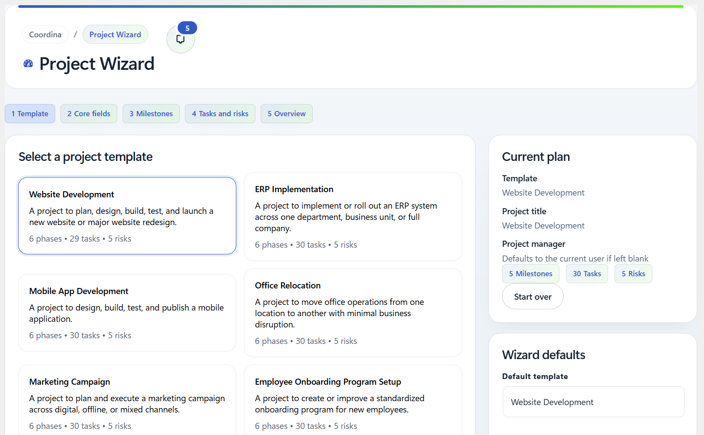
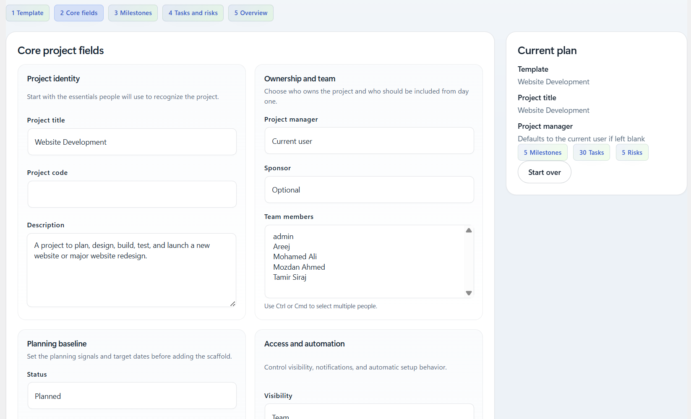
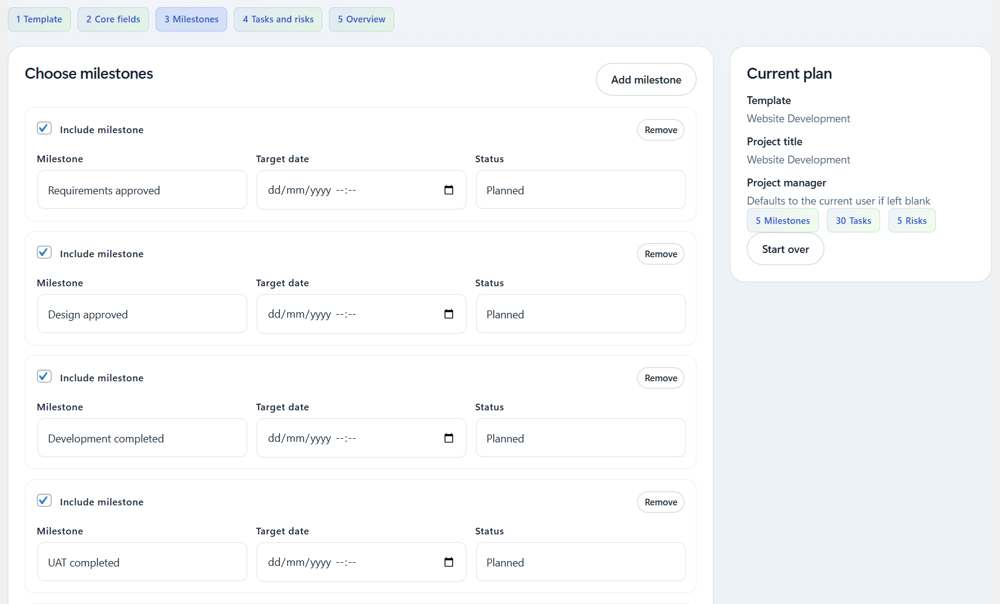
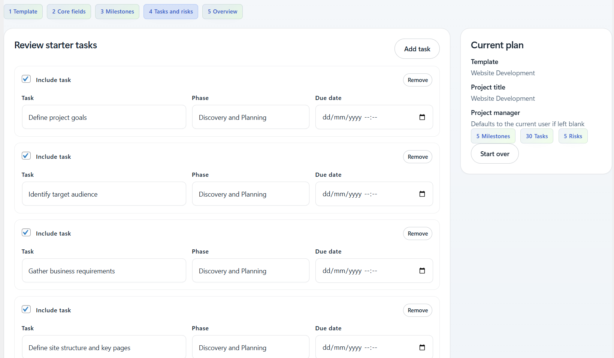
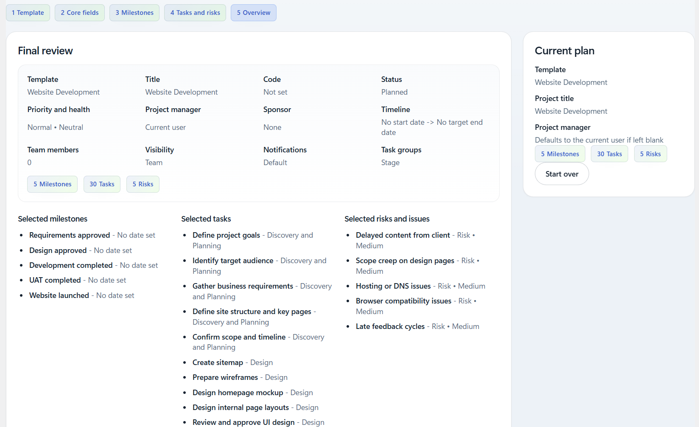

# Coordina Project Wizard

Coordina Project Wizard is a separately packaged WordPress add-on for Coordina. It provides a guided, multi-step project setup flow based on reusable templates, then creates the selected starter structure through Coordina's public platform contracts.

## What It Does

- shows a multi-step project creation wizard inside Coordina
- starts from a template catalog generated from shared project templates
- prepopulates core project details from the selected template
- lets teams review and tailor milestones, starter tasks, and starter risks before creation
- creates projects through Coordina's public contracts instead of direct core coupling

## Requirements

- WordPress 6.6 or newer
- PHP 7.4 or newer
- Coordina core plugin with the modular platform layer available [https://github.com/khalidhamada/coordina](https://github.com/khalidhamada/coordina)

## Installation

1. Copy the `coordina-project-wizard` folder into `wp-content/plugins/`.
2. Install the main Coordina plugin from https://github.com/khalidhamada/coordina.
3. Activate the main Coordina plugin.
4. Activate `Coordina Project Wizard` from the WordPress Plugins screen.
5. Open the Coordina Projects area and launch the wizard.

If Coordina core is missing or inactive, WordPress will block this add-on from activating and show an admin notice until the dependency is available.

## Screenshots

### Template Selection

### Project Details

### Milestone Planning

### Starter Tasks

### Final Review

## Architecture Notes

- provider registration happens through `coordina/platform/providers`
- entitlement integration happens through `coordina/platform/entitlement-providers`
- wizard setup data comes from `config/project-template-catalog.json`
- project creation is handled through the add-on service layer under `src/`
- wizard admin UI is isolated to `assets/admin/`

## Documentation

- Release index: [RELEASE_NOTES.md](RELEASE_NOTES.md)
- Current release notes: [releases/v0.2.0/RELEASE_NOTES.md](releases/v0.2.0/RELEASE_NOTES.md)

## Version

Current plugin version: `0.2.0`